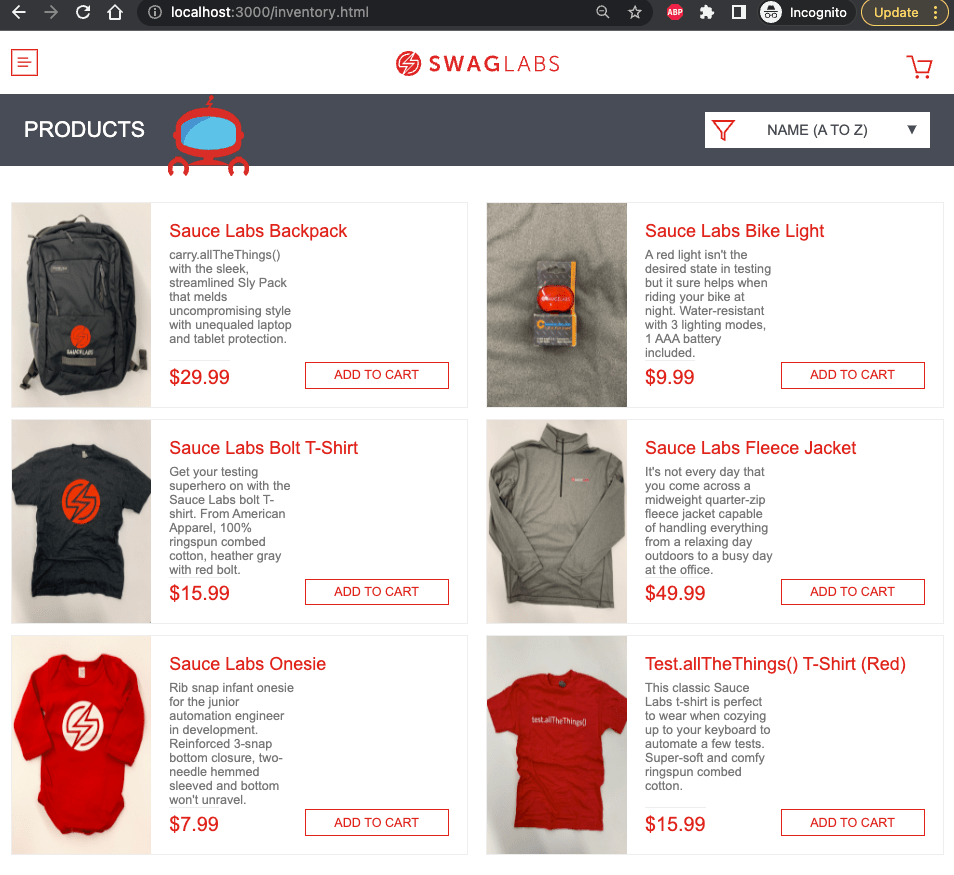

# Sauce Demo E-Commerce Web App

A modern e-commerce demo application built with React, featuring a complete shopping experience with authentication, product catalog, cart management, and checkout flow.




## 🚀 Live Demo

**Production:** [Deployed on Vercel](https://your-app.vercel.app) _(will be available after deployment)_

## 🛠️ Tech Stack

- **React** 17.x - UI library
- **React Router** - Client-side routing
- **React Burger Menu** - Mobile navigation
- **FontAwesome** - Icons
- **JS Cookie** - Session management
- **CSS3** - Styling

## ✨ Features

### Authentication
- ✅ Login with multiple user types
- ✅ Session management with cookies
- ✅ Protected routes
- ✅ Logout functionality

### Product Catalog
- ✅ Product listing with images
- ✅ Product details
- ✅ Sorting (A-Z, Z-A, Price)
- ✅ Add/Remove from cart

### Shopping Cart
- ✅ Add/remove items
- ✅ Quantity management
- ✅ Cart badge indicator
- ✅ Persistent cart state

### Checkout Flow
- ✅ Customer information form
- ✅ Order summary
- ✅ Order confirmation
- ✅ Form validation

## 📦 Installation

### Prerequisites
- Node.js 16+ (Node 18 recommended)
- npm or yarn

### Setup

```bash
# Clone repository
git clone https://github.com/oktavian1/sauce_demo_app.git
cd sauce_demo_app

# Install dependencies
npm install
```

## 🧪 Development

### Start Development Server

**For Node 16:**
```bash
npm start
```

**For Node 17+:**
```bash
npm run start-18
```

The app will be available at: `http://localhost:3000`

### Build for Production

```bash
npm run build
```

Build artifacts will be in the `build/` directory.

## 🧪 Testing

This application is tested using **Playwright** end-to-end tests.

Test repository: [automation_sauce_demo](https://github.com/oktavian1/automation_sauce_demo)

### Test Coverage
- ✅ Login flows (valid/invalid credentials)
- ✅ Product browsing and sorting
- ✅ Cart management
- ✅ Checkout process
- ✅ Error handling

## 🚀 Deployment

### Automatic Deployment (Recommended)

This project is configured with **GitHub Actions** for automatic deployment to **Vercel**.

**Workflow:**
1. Push code to `main` or `master` branch
2. GitHub Actions builds the app
3. Deploys to Vercel
4. Runs E2E tests against deployed app
5. Reports test results

### Manual Deployment to Vercel

```bash
# Install Vercel CLI
npm i -g vercel

# Deploy
vercel --prod
```

### Required Secrets (GitHub Repository Settings)
- `VERCEL_TOKEN` - Vercel deployment token
- `VERCEL_ORG_ID` - Vercel organization ID
- `VERCEL_PROJECT_ID` - Vercel project ID

## 🔐 Demo Users

### Standard User
- **Username:** `standard_user`
- **Password:** `secret_sauce`
- Full access to all features

### Locked Out User
- **Username:** `locked_out_user`
- **Password:** `secret_sauce`
- Login blocked (for testing)

### Problem User
- **Username:** `problem_user`
- **Password:** `secret_sauce`
- Experiences UI glitches (for testing)

### Performance Glitch User
- **Username:** `performance_glitch_user`
- **Password:** `secret_sauce`
- Slow response times (for testing)

## 🤖 CI/CD Pipeline

This project uses **GitHub Actions** for continuous integration and deployment:

### Workflow Steps:
1. **Build & Deploy** - Build React app and deploy to Vercel
2. **E2E Testing** - Run Playwright tests against deployed app
3. **Reporting** - Upload test reports and videos as artifacts

## 📊 Quality Assurance

- ✅ **Automated E2E Testing** - Full user journey coverage
- ✅ **Cross-browser Testing** - Chromium, Firefox, WebKit
- ✅ **CI/CD Integration** - Tests run on every push
- ✅ **Test Reports** - HTML reports with screenshots/videos

## 🤝 Contributing

This is a portfolio project, but suggestions are welcome!

1. Fork the repository
2. Create a feature branch (`git checkout -b feature/amazing-feature`)
3. Commit your changes (`git commit -m 'Add amazing feature'`)
4. Push to the branch (`git push origin feature/amazing-feature`)
5. Open a Pull Request

## 📝 License

This project is for portfolio demonstration purposes.

Original application forked from [saucelabs/sample-app-web](https://github.com/saucelabs/sample-app-web).

## 👤 Author

**Oktavian**
- GitHub: [@oktavian1](https://github.com/oktavian1)

## 🔗 Related Projects

- [Automation Test Suite](https://github.com/oktavian1/automation_sauce_demo) - Playwright E2E tests for this app

## 📚 Resources

- [React Documentation](https://react.dev/)
- [Vercel Documentation](https://vercel.com/docs)
- [Playwright Documentation](https://playwright.dev/)
